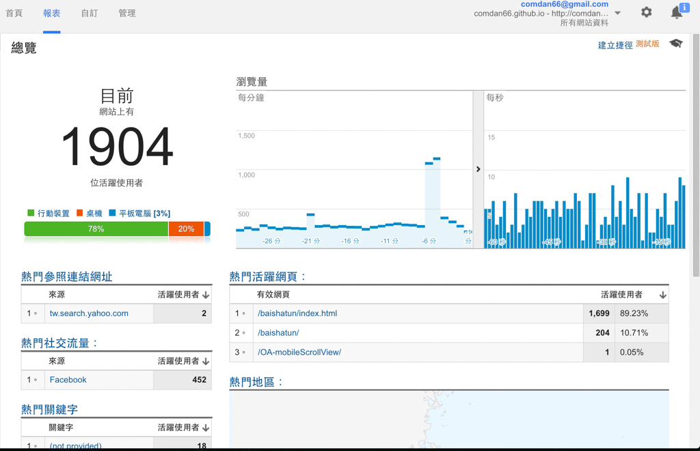
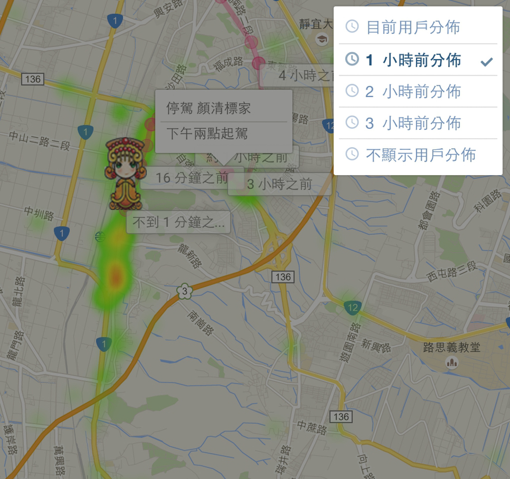

# 2016 白沙屯媽祖南下進香 GPS 系統

白沙屯媽祖南下北港遶境 GPS 定位實作，是我目前 [Google Analytics(GA)](https://www.google.com/intl/zh-TW_tw/analytics/) **即時流量** 最高也是 Server Loading 最大的任務之一，實作過成功嘗試多樣的系統架構，以達成最低成本、最高效率的方式服務信徒。

此項任務難點會在活動期間會有大量的 Request 打進 Server，所以勢必會對伺服器造成極大的負擔，所以每個細節的效能都必須兼顧！因為考慮到 Request 數量龐大，於是就採用前後分離的方式，先進行第一階段的「節能」。

前後分離顧名思義，就是將前端的 HTML、JavaScript、css 與後端的 php、MySQL 拆開來，將前端的部分放置在 GitHub 的 [GitHub.io](https://pages.github.com/) 上，因為 GitHub.io 是一個可以提供大量靜態當案的服務又是免費的，所以當然當作首選！若是要採用其他平台也可以，不過當然要能撐得住大流量！

接著串接後端資料的方式則是採用 [AJAX](https://zh.wikipedia.org/wiki/AJAX) 技術，利用 AJAX 的方式，每分鐘回去撈一次最新的位置資訊，此架構就能達到系統只需要產出 Json 格式的輸出即可，必要時更可以針對 API 的輸出做 File Cache 亦或者 Memory Cache 來提升後端效能。

不過當活動開始時，GA 即時人數達到 1,000 人左右時，漸漸地出現後端系統 Loading 過大的狀況，經由檢查後端伺服器在記憶體的部分發現高達 80%(1GB)，所以猜測可能是 AJAX 的 Request 量過大， 1,000 人同在線上，每分鐘各發送一次 Request，所以難免對系統負擔過大，不過後端硬體設備我採用 [AWS t2.micro](https://aws.amazon.com/tw/ec2/instance-types/) 免費版本，能撐到這樣的流量已經算不錯了，但為了讓網頁能夠更加暢通，於是就做了部分架構更動。

在 AWS 上有一項不錯的服務，可以提供巨大的空間以及龐大的流量輸出的服務叫做 [Simple Storage Service(S3)](https://aws.amazon.com/tw/s3/)，在這個系統上新用戶一樣可以一年免費，所以使用上依然免費！

那要如何將 GitHub.io 與 S3 結合，更又要可以有 API 即時的串接呢？其實我採用的做法是在伺服器上寫了一個排程，在 **每分鐘** 亦或者 **半分鐘** 將 API 的結果(路徑)以 Json 檔案格式上傳到 S3 上面去，再設定一下 S3 的 [Cross-Origin Resource Sharing](http://docs.aws.amazon.com/zh_cn/AmazonS3/latest/dev/cors.html)，加入設定要分享的 Domain，如此一來在 GitHub.io 的前端 JavaScript 即可以透過 AJAX 的方式取得 S3 上面的 Json 資料囉！若要做到更有效的節能更可以搭配 [CDN](https://zh.wikipedia.org/wiki/%E5%85%A7%E5%AE%B9%E5%82%B3%E9%81%9E%E7%B6%B2%E8%B7%AF) 設定 TTL(Time To Live)。

雖然這個做法比起 [WebSocket](https://zh.wikipedia.org/zh-tw/WebSocket) 來的不及時，但是時間誤差值充其量也才差 2分鐘內，就活動的需求已經足夠了！有了這個架構之後，AJAX 都去 S3 上面取得資料了，後端自然輕鬆許多，而專案更能夠依照此架構延伸更多功能，例如：聊天室、使用者分佈.. 等，在這樣的架構下 GA 紀錄曾經高達 2,000 人同時在線上也不會有任何的操作不順或者 Lag 的問題！。

此專案目前沒開啟 Live Demo，主要原因是目前活動已經結束，另外則是 GPS 數據來源網站目前未授權，所以這部分大家若有興趣，可以直接到我 GitHub 上去了解程式碼部分。

### 相關參考
* [GitHub 原始碼](https://github.com/comdan66/baishatun)

`#Google Maps` `#GPS` `#白沙屯` `#媽祖`