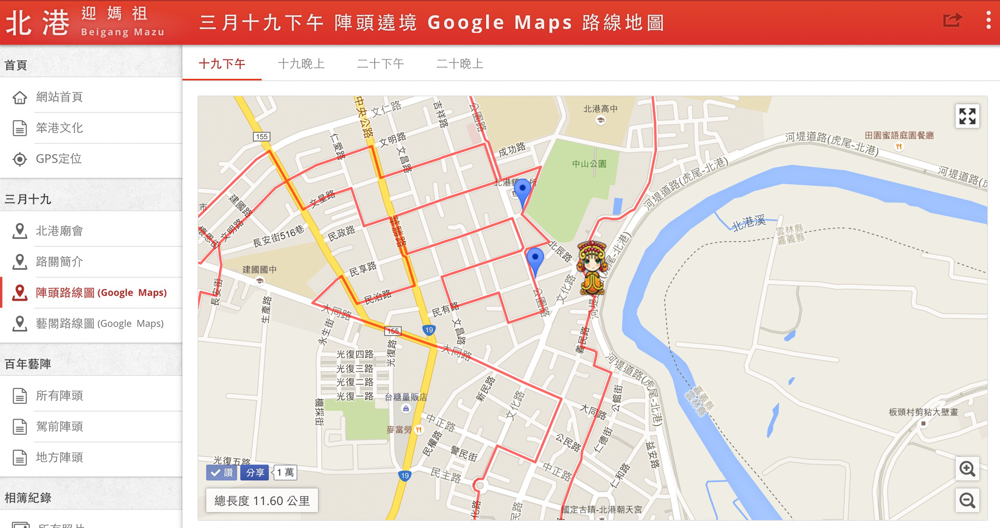
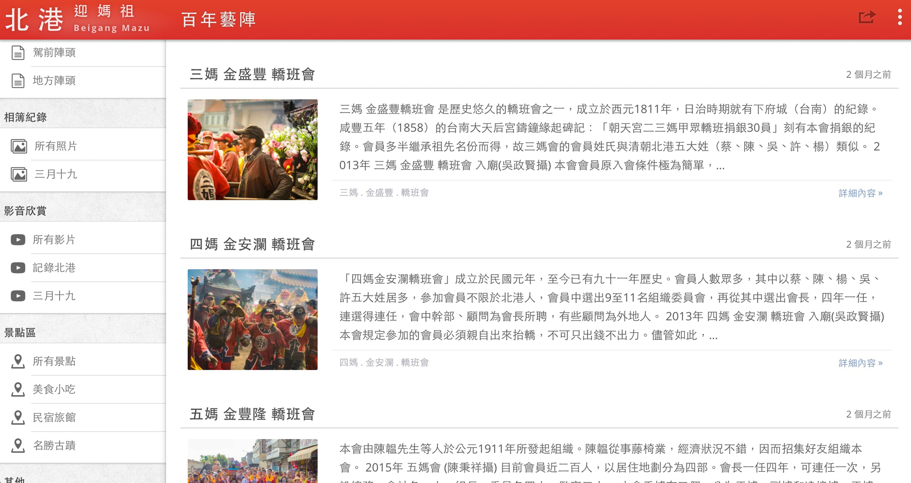
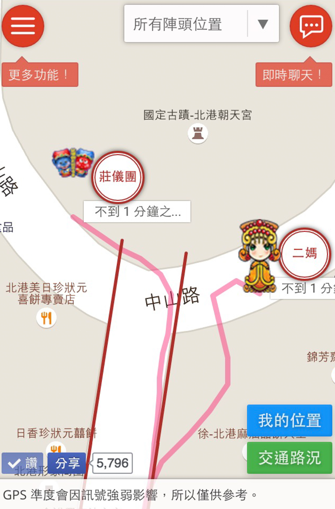
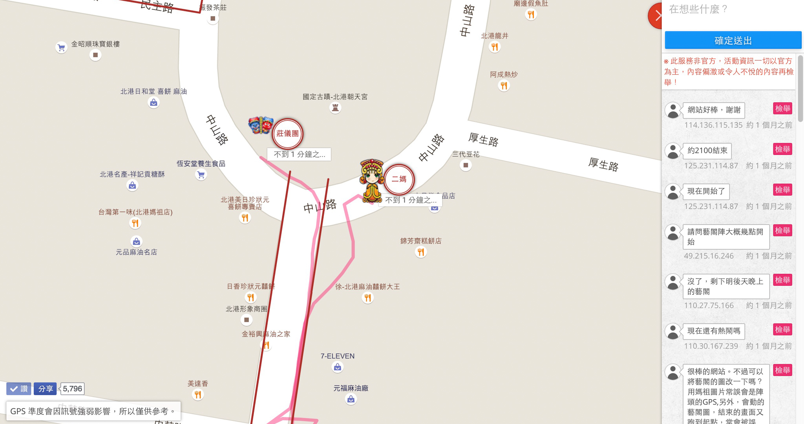
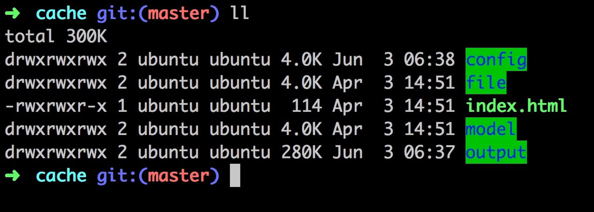
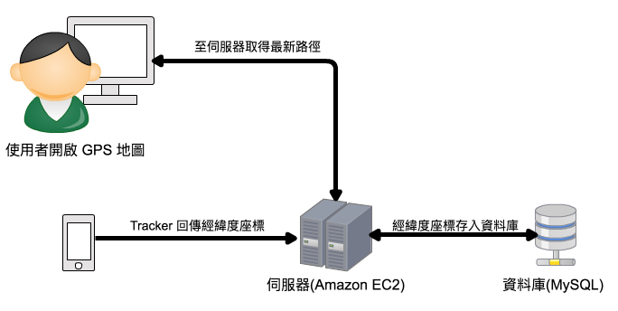
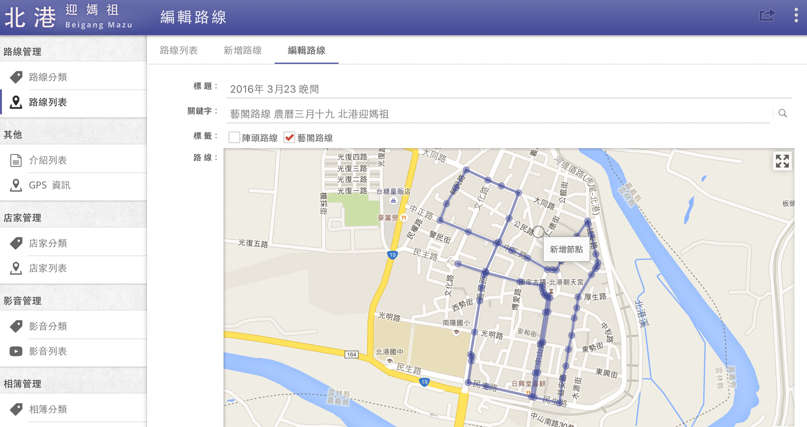
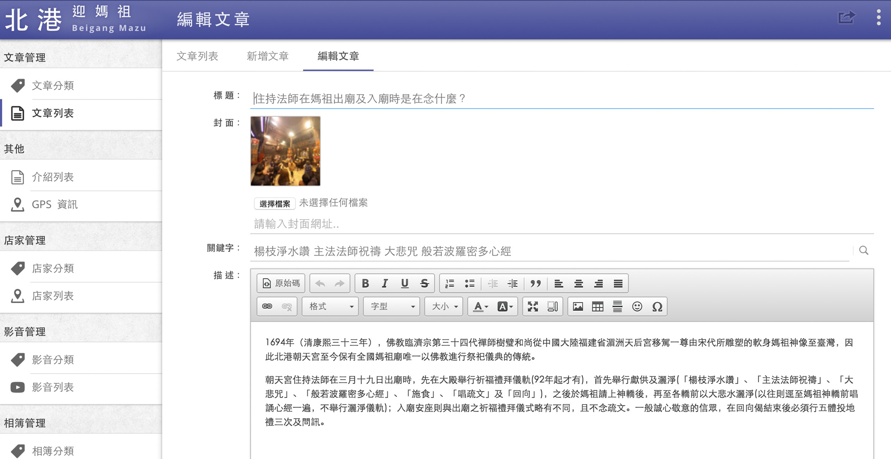
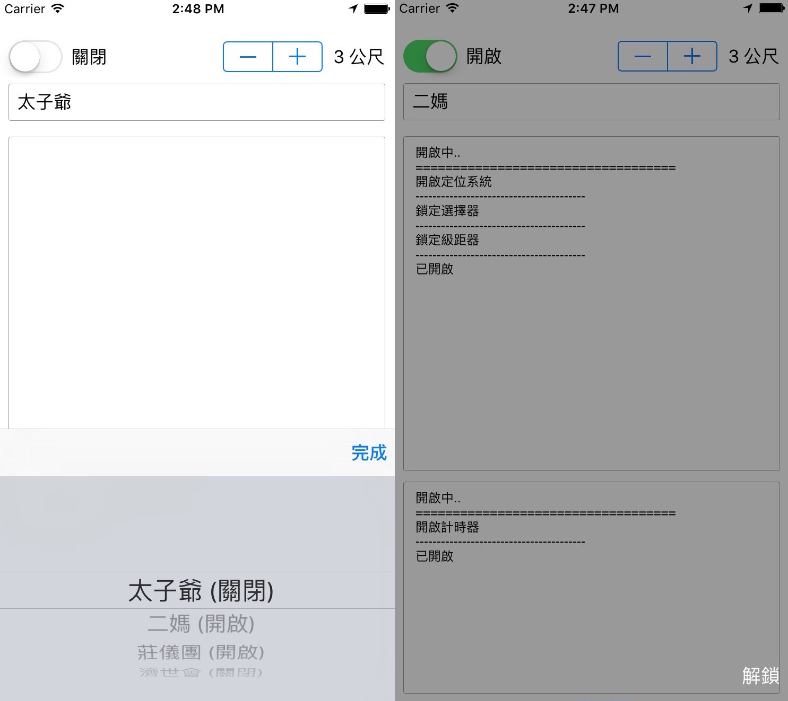
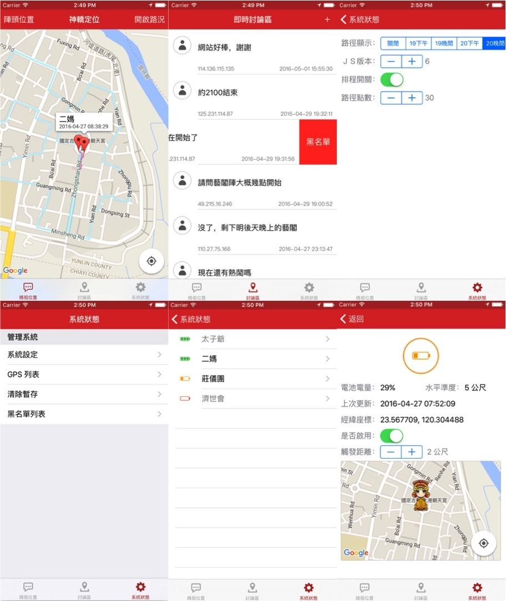

# 2016 北港迎媽祖

北港迎媽祖，這是個為我的家鄉的活動製作網站，幾本上是屬於義務性幫忙、沒盈利的非官方服務。每年我都會在 **北港農曆三月十九迎媽祖** 前數個月開始製作，目前為止這網站我算是不斷自我突破吧！整體從 **設計**、**後端**、**系統**、**切版**、**攝影**、**上稿**，基本上都是我嘗試一個人完成！以下主要分享一下**設計**、**前端**、**後端**以及**系統**部分，有興趣的可以繼續往下看！

網誌是以服務為性質的產品，所以首當其衝的排版就非常重要，於是我參考了 Google 所制定的 [Material Design](https://www.google.com/design/spec/material-design/introduction.html)，整體就用 Material 的角度去設計版面以及流程。不過當然 App 與網頁的表現還是會有些許的差異，但是整體我仍然盡量參考規範。而除了 Material Design 外，[RWD 響應式設計](https://zh.wikipedia.org/wiki/%E5%93%8D%E5%BA%94%E5%BC%8F%E7%BD%91%E9%A1%B5%E8%AE%BE%E8%AE%A1) 也是一項必須完成的步驟，考量到多數使用者都是手機用戶，所以在頁面上都必須加入響應式設計的考量，尤其在地圖頁面上，更是斟酌使用者需求特別將地圖滿版！總結整體版型設計就是 Material RWD 版本！

決定好版型後就是要進行前端實作的切版與功能，切版方式我採用 [Compass](http://compass-style.org/) 來編譯 [SCSS](http://sass-lang.com/)，如此一來不僅版型可以針對 RWD 不同的樣式做變數設定外，也可以快速的針對不同主題色作調整，最重要的是 scss 語法結構可以作縮排、層級的概念，這對於開發上的管理維護非常有幫助。

前端除刻板外，另一項重點就在 [JavaScript](https://zh.wikipedia.org/zh-tw/JavaScript)，因為要把廟會遶境路線與 Google Maps 結合，以及在 Google Maps 上顯示活動當天的即時位置，所以在這部分的前端、後端效能必需要下苦功。不過這部分幸好三年前就開始累積 [Google Maps JavaScript API](https://developers.google.com/maps/documentation/javascript/?hl=zh-tw) 的開發經驗，同時再配合自行開發的後端 [API](https://zh.wikipedia.org/zh-tw/%E5%BA%94%E7%94%A8%E7%A8%8B%E5%BA%8F%E6%8E%A5%E5%8F%A3)，所以不成問題。

後端 php 這次我就使用很潮的 [PHP7](http://php.net/manual/en/migration70.new-features.php)，整體用下來的感覺貌似有變快，因為我的排程變快許多，整體來說算是很滿意，Framework 則有些 Function 需稍做調整，不過大致上都很健康，當然也順便將我的 [OACI](https://github.com/comdan66/oaci) 給更新到可與 PHP7 相容！

框架是使用 [OACI](https://github.com/comdan66/oaci)，這是一套自行修改的 Framework，將原本的 [CodeIgniter](https://codeigniter.org.tw/) [v2.1.4](https://codeigniter.org.tw/downloads/file/CodeIgniter_2.1.4) 做了一些修改。主要是加入了些功能，例如：當部署至 Production 時，可自動的將 css、JavaScript 等檔案，就可以自動的 merge、minify、uglify，並且上傳到 [Amazon Amazon Simple Storage Service(S3)](https://aws.amazon.com/tw/s3/)，而圖片檔若是遇到大檔案，則利用 [TinyPNG](https://tinypng.com/) 去對圖片做壓縮後再上傳到 S3，當然，以上都是使用程式自動化完成的！

後端優化除了使用 S3 來分擔伺服器的 Loading 外，另一項就是需要大量的作快取，因為基本上網站前台都是使用大量的文章以及簡介，所以可以做大量的 cache，不過這部分只採用 File Cache 而已，雖然我有原本打算使用 [Redis](http://redis.io/) 去實作，但是我把記憶體留給資料庫了.. (我沒開 RDS，MySQL 是上在與 Server 同一台的 EC2)

既然有作 Output 的快取，所以我也順便將 HTML 壓縮，因為 Output Cache，也就是說 Request 進來是不會去執行 php，那就無法紀錄瀏覽人數的紀錄了，為了解決這個問題，這部分我使用 AJAX 去實作人氣累計的功能。

上面提到活動期間會使用 GPS 回傳即時定點位置的功能以及效能問題，那就順便分享調整效能的經驗。需要做到及時回傳位置的話，就代表需要 GPS Tracker 配合，Tracker 我採用自己開發的 [iOS App](https://github.com/comdan66/mazu/tree/master/ios/MazuMarch)。活動期間將各個 Tracker 部署到各個陣頭後，在固定時間內 Tracker 會將經緯度以及相關資訊回傳至伺服器，伺服器再將座標存入資料庫，並且將路徑資訊整理完後，以 [.json](http://www.json.org/) 格式的方式上傳至 S3，同時 GPS 活動頁上再利用 JavaScript 的 [AJAX](https://zh.wikipedia.org/zh-tw/AJAX) 以固定的時間向 S3 取得最新路徑！

**為什麼要用 S3！？**若是路徑資訊的 .json API 不放 S3，而改放在伺服器的話，活動當天勢必會有龐大的流量進來，又加上固定時間會背景執行 AJAX 取得最新路徑，如此龐大的流量加上固定時間 AJAX 的 Request 勢必會衝垮伺服器的！所以才將路徑資訊先產出，並且放至 S3，讓所有用戶端的 Request 往 S3 取得，而 S3 可以支援大量的流量，並且計費極低，完完全全可以頂住流量問題，再搭配上 [CDN](https://zh.wikipedia.org/wiki/%E5%85%A7%E5%AE%B9%E5%82%B3%E9%81%9E%E7%B6%B2%E8%B7%AF) 後，不僅後端效能提升了，前端感受體驗也會順暢許多！

除了效能與架構，這次我也加強了多項 [SEO](https://zh.wikipedia.org/zh-tw/%E6%90%9C%E5%B0%8B%E5%BC%95%E6%93%8E%E6%9C%80%E4%BD%B3%E5%8C%96) 優化，首先設定 robots.txt、sitemap、關鍵字優化，並且至各大搜尋引擎加入 sitemap 與設定，這次還加入部分的 [Schema](https://schema.org/)、[Google AMP](https://www.ampproject.org/docs/get_started/about-amp.html)、[JSON-LD](http://json-ld.org/) 的結構，這些步驟都是去餵搜尋引擎想吃的菜，已達到所有可能的曝光與分享！目前在 Google 搜尋 “北港迎媽祖” 都有在前兩頁的曝光，加上有 RWD 加持之下，手機的搜尋曝光更高了！

其實這次開發很多功能，例如：網站不只前台技術，後台也有多項 CRUD 的功，其中也包含了地圖編輯，後台人員可以自行的編輯遶境路線圖抑或者地圖資訊，此功能對於網站維護是一項重點任務。網站除了地圖重點外，多項內容則是使用文章的方式顯示，所以文章編輯器是必備的一項功能。活動當天管理人員必然會在外面忙碌，所以有關電腦的相關設定或者 GPS Tracker 狀態管理、聊天室的狀況，都做成[手機 App](https://github.com/comdan66/mazu/tree/master/ios/MazuMarchAdmin)，以達到有效的管理。由於 AWS S3 架構方便、便宜、大頻寬，所以將其進階運用，使用 S3 來存放大量的聊天室內容，當使用者留言時，EC2 再將其資訊補至 S3，而聊天室每 10 秒再藉由 Ajax 往 S3 取得聊天室內容。

其實在開發過程中學到很多經驗也嘗試很多架構，這次我使用 AWS 的服務主要開了一台東京 [t2.micro](https://aws.amazon.com/tw/ec2/instance-types/) 的 EC2，以及使用 S3 的服務而已，依據 GA 的網頁流量服務測得 **即時人數** 最高曾經落在 **1900 人左右同時在線上**，可能有些頁面是使用 S3 吧，所以都撐得住！這是目前我個人做過最高流量的網站，相對的也是個人里程碑，回到做網站初衷，我只是個熱愛故鄉的鄉土文化，想為家鄉盡一分力，利用自己的專長技術，支援這個從小的信仰如此簡單。

### 相關參考
* [GitHub 原始碼](https://github.com/comdan66/mazu)
* [PTT Yunlin](https://www.ptt.cc/bbs/Yunlin/M.1460567509.A.8BE.html)
* [PTT Soft_Job](https://www.ptt.cc/bbs/Soft_Job/M.1460607450.A.36A.html)
* [Facebook Front-End Developers Taiwan](https://www.facebook.com/groups/f2e.tw/permalink/980856278618404/)

`#Google Maps` `#GPS` `#北港` `#朝天宮` `#媽祖`