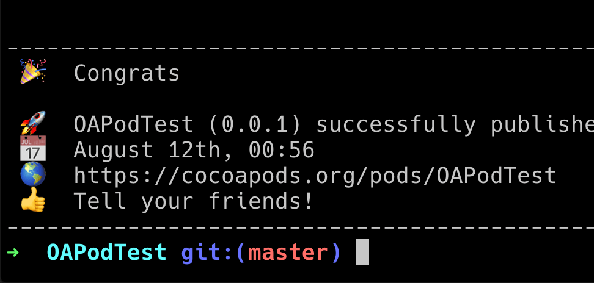

# 自己做自己的 CocoaPods

寫到一定程度之後，總會有幾個自己愛用語熟悉的 Lib，那就自己做一下屬於自己的 pod 套件吧！


## 新增
以下會用 `OAPodTest` 當作套件名稱範例，各位要做自己的套件請用自己的名稱捏！
由於 pod 套件可與 [GitHub](https://github.com/) 綁定，讓他自動去抓上面的原始碼，所以請先開一個 GitHub repository！

這是我自己的 GitHun Repository：[https://github.com/comdan66/OAPodTest](https://github.com/comdan66/OAPodTest)

* 先把 GitHub 上的專案 Clone 下來
* 進入專案，然後執行指令 `pod lib create OAPodTest`，Pod 會自動去 `https://github.com/CocoaPods/pod-template.git` 複製一份 `.podspec` 樣式下來

### 依據步驟回答即可
* What platform do you want to use?? [ iOS / macOS ]  
此 lib 是給哪種系統平台用？  
➜ iOS
* What language do you want to use?? [ Swift / ObjC ]  
此 lib 是主要哪種語言？  
➜ Swift
* Would you like to include a demo application with your library? [ Yes / No ]  
此 lib 裡面要不要給予 Demo 範例  
➜ Yes
* Which testing frameworks will you use? [ Quick / None ]  
測試框架，不知道用在哪ＸＤ  
➜ None
* Would you like to do view based testing? [ Yes / No ]  
不知道ＸＤ  
➜ No

### 編輯與設定
* 編輯 `OAPodTest.podspec`
* 通常需要以下幾個項目：
	* s.name                  名稱
	* s.version               版本
	* s.summary               簡述
	* s.description           描述
	* s.homepage              GitHub 網址
	* s.license               授權
	* s.author                擁有者
	* s.source                原始碼
	* s.social\_media_url     介紹的網頁
	* s.ios.deployment_target 版本限制
	* s.source_files          原始碼位置
	* s.frameworks            使用哪些框架

> 通常要該改的有 name、version、summary、description、social\_media_url、ios.deployment_target、frameworks

## 撰寫範例
* 打開 `Example/OAPodTest.xcworkspace`
	* 目錄 `Example for OAPodTest` 是提供範例的地方
	* 目錄 `Pods/Development Pods/OAPodTest/` 下為 lib 的地方，`ReplaceMe.swift` 就是要你把 lib 放在這邊的意思，您可以自己更換名稱或新增其他檔案

* ReplaceMe.swift 內容範例

```Swift
public func testFunc(_ a: Int) -> String {
    return String.init(format: "Int: %d", a)
}
```

* 編輯 `Example for OAPodTest/ViewController.swift` 在上面加入 `import OAPodTest` 即可使用 `testFunc`

## 部署
* 首次部署記得檢查此 Git 有無設定 github 的 origin，沒有的話可以執行指令 `git remote add origin https://github.com/comdan66/OAPodTest.git` 設定
* 設定版號，修改 `OAPodTest.podspec` 內的 `version`，改為 `0.0.1`(此版本號碼您可自己設定)
* 先做 git push 以及 tag 的 push
	* 全部加入並且丟到 origin，執行指令：`git add -A && git ci -m 'Fix .podspec' && git ps master`
	* 新增一個 Tag 名稱為 `0.0.1`，並且將 tag 也丟到 origin，執行指令：`git tag 0.0.1 && git push --tags`
* 更新至 pod
	* 檢查 Github 頁面有無 `0.0.1` 的 tag
	* 丟上去，這邊會有點久，執行指令：`pod trunk push OAPodTest.podspec`
	* 如果有警告的情況，要忽略警告可以加上 `--allow-warnings` 參數，指令：`pod trunk push OAPodTest.podspec --allow-warnings`，通常你如果 `.podspec` 內容沒修改敘述之類的，他會警告你
	* 成功的話 理論上 `https://cocoapods.org/pods/OAPodTest` 可以直接有網頁看得到，或者可以用指令 `pod trunk info OAPodTest` 檢查是否有存在以及其線上相關版號資訊



## 取用
* 測試有無存在，執行指令：`pod trunk info OAPodTest`
* 開新的 ios Swift 專案名稱為 `Test`，並且做 [pod init](https://www.ioa.tw/Develop/iOS-CocoaPods-note.html)
* 編輯 `Podfile`，加入 `pod 'OAPodTest'` 然後儲存
* 執行安裝 pod 執行指令：`pod install`，然後執行 `Test.xcworkspace`
  * 可以檢查目錄 `Pods/Pods/` 內應該可以看到 `OAPodTest` 目錄
  * 可以在 `Test7/Test7/ViewController.swift` 內寫個測試，檔案開頭加入 `import OAPodTest` 就可使用 `testFunc`

## 刪除
  * 執行指令：`pod trunk delete OAPodTest 0.0.1`，然後輸入 `yes` 即可
  * 刪除完後，可在用 `pod trunk info OAPodTest` 檢查資訊


### 相關參考
* [CocoaPods.org](https://cocoapods.org/)
* [https://medium.com/practical-code-labs/how-to-create-private-cocoapods-in-swift-3cc199976a18](https://medium.com/practical-code-labs/how-to-create-private-cocoapods-in-swift-3cc199976a18)
* [https://www.jianshu.com/p/4b63dfbd8be7](https://www.jianshu.com/p/4b63dfbd8be7)

`#iOS` `#Xcode` `#CocoaPods` `#App` `#GitHub`