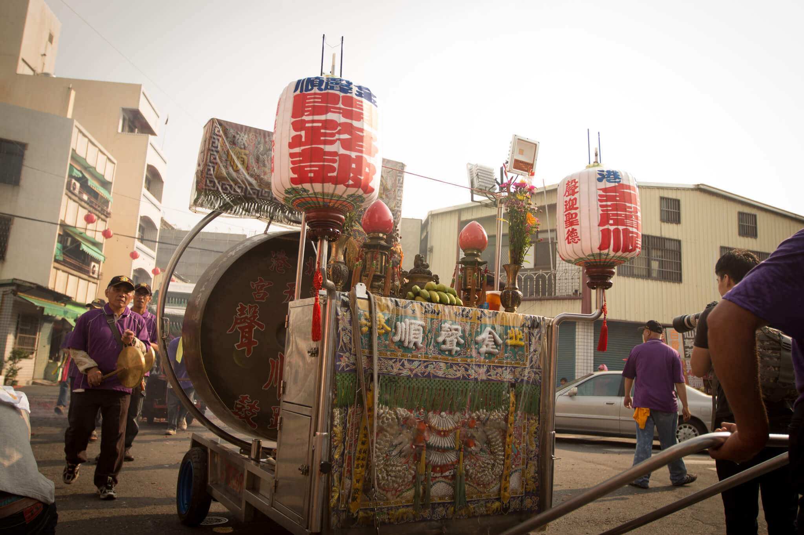
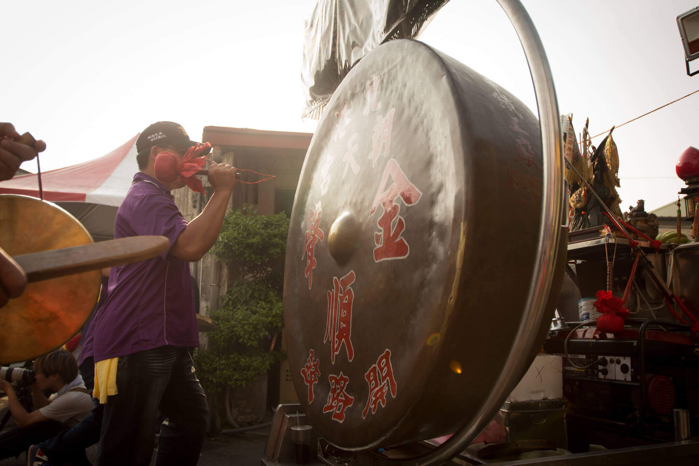
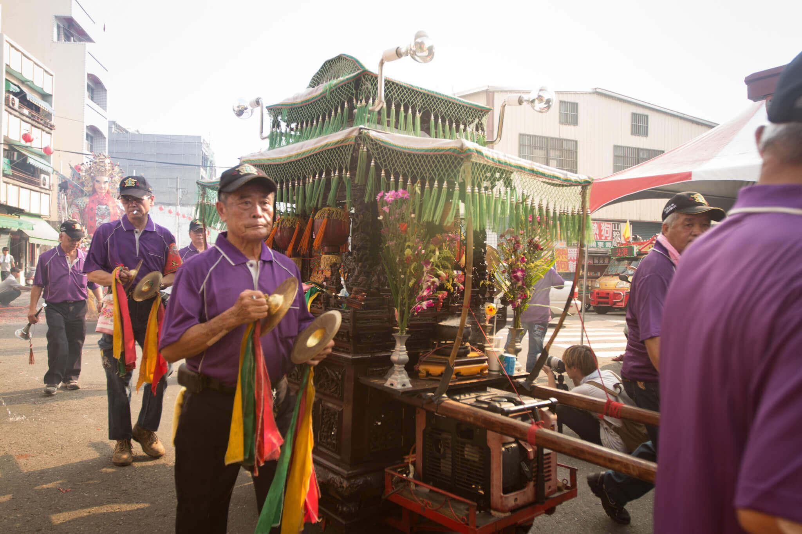
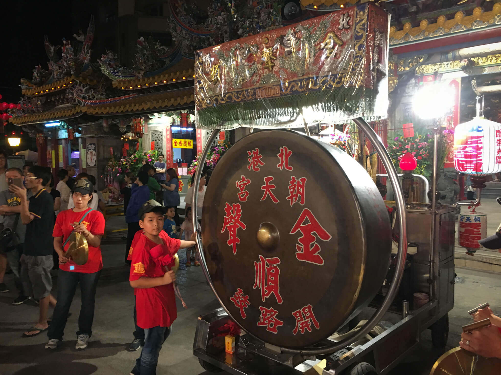

# 金聲順

開路鼓，是舉凡廟會活動大家都會看到的一個藝陣，顧名思義就是開路，每當聽到北港的開路鼓聲時，都會有一種錯覺，「疑！？今天什麼日子！？趕快！拿椅子出來等待，陣頭快來了！」的錯覺！

北港的開路鼓有很多，像是[金聲順](../2017.04.17 | 金聲順)、[聖震聲](../2017.04.18 | 聖震聲)都是耳熟能響的開路大鼓，不過雖名為開路大鼓，其實他最大的特色是在他的大鑼喔，「框」 的一生，緊接的鑼鼓齊奏，遠遠的就知道 **陣 頭 來 囉**！

依照傳統，廟會出巡繞境時，鑾駕最前面必有鑼鼓隊作為前導，以巨大鑼鼓聲宣示媽祖聖駕到了，提醒民眾迴避讓路、擺香案迎接膜拜。這支前導的鑼鼓隊，民間稱謂「開路大鼓」或「開路鼓」，意為媽祖聖駕前導開路的鑼鼓隊。北港這支鑼鼓隊，最初以民眾稱謂的「開路鼓」為隊名，是出巡時不可或缺的隊伍。

清同治五年(1865)，**楊添丁**、**蔡宣德**、**蔡老慶**、**王如山**及**蔣馬來**等開路鼓先賢認為開路鼓應比照媽祖轎班會一樣，年年有集會，用擲筊方式擇定值年爐主，於是奉祀唐玄宗時之「霓棠羽衣曲」及精通各種樂器的田都元帥為祖師爺，並將開路鼓隊命名為「北港路關鼓」，仍隸屬於朝天宮。

「北港路關鼓」多數演奏由田都元帥所譜之曲如：江風、玉芙蓉、大瓶爵、東華福星及月眉詞等樂曲，因其鼓聲雄壯渾厚有力，嗩吶聲響亮節拍分明，大小銅鈸和大鑼聲響亮震天，為遶境隊伍增添了莊嚴、雄偉、熱鬧的氣氛，是迎神、酬神、廟會中不可缺少的樂陣。

清宣統三年(1911)朝天宮管理人**蔡然標**秀才，認為擁有一百多年歷史的開路鼓，名稱似缺文雅且無法表現聲震金闕的雄威，乃易名為「**北港金聲順開路鼓**」，此名獲得團員支持，他並為「北港金聲順開路鼓」寫對聯，橫聯為「**金鼓威聲開路順**」，直聯為「**聲金振玉明條理**、**順韻喧音有始終**」。團員李坤、楊土墻，楊定等人為不辜負蔡秀才的用心，並為培植後起之秀，於是招募團員二十餘人開班傳藝，由**李坤**等人利用夜間在彌陀寺悉心指導。

阡據時期日人全力推動「皇民化」，由於朝天宮為台灣人信仰中心，加上日本官吏也體驗媽祖靈感，在摧毀奉祀中國神明廟宇聲中，對北港朝天宮「特別禮遇」。在朝天宮管理人蔡然標主張「音樂無國境」之下，讓「金聲順開路鼓」得以繼續演奏傳承。此期間培養的傑出樂員李淵、陳高城，光復後全力投入傳藝工作，擔任師傅並領導金聲順，使金聲順開路鼓樂藝精進，成為台灣首屈一指的開路鼓隊，奠定了今日執牛耳的穩固基礎。

受金聲順台柱父親楊定影響，自幼耳濡目染且對開路鼓樂藝有興趣的七十多歲鼓手楊松村說：「傳統鼓樂，與現代的西樂有 C、D、E、F、G、A、B 調相同。自古就有其樂調，如正館、邑公調、邑士調、邑六調…等，也自有演奏法，已達到律呂調陽境界。

開路鼓的鼓、鑼、銅鈸不是隨便敲打，鎖吶也不是隨便吹；大鼓必需配合嗩吶吹奏樂曲依章法打。稱為「下架」的大小銅鈸、大小鑼要配合鼓聲及樂曲敲打，也有規定章法，如西樂的曲調、節拍、樂聲強弱等絲毫不能有差錯，一有差錯就失去調和而貽笑大方。

金聲順現擁有祖師田都元帥的譜曲三百餘首，演出時的指揮是叫「頭吹」的一號嗩吶吹手，他吹出第一音，「二吹」、「三吹」及其餘吹手就立刻知道要吹那一首曲，打鼓的鼓手也是如此。「下架」要配合鼓聲，所以樂員必需熟習全部樂曲及演奏方法，因此特別注重平常的讀譜與練習演奏。楊松村說：開路鼓這個名稱，乍聽起來是以鼓為主，其實是以一般叫「鼓吹」的嗩吶為主，「鼓吹」吹出甚麼樂曲，大鼓立即配合，「下架」的大小銅鈸及大小銅鑼再配合大鼓敲打，就因鼓聲、銅鈸、銅鑼聲音大，會把鼓吹聲壓制下來，行家要從鼓聲、銅鈸及銅鑼聲中聽出鼓吹聲來，鼓吹吹的好壞非常重要，因此鼓樂人士說鼓吹是開路鼓或鼓樂隊的靈魂，並非誇大之詞。

以金聲順為例，近百年來樂家都推崇已仙逝的李淵、陳高城是第一把交椅的吹手，吹出的聲音不僅正確、圓滑、響亮，有如「行雲流水」般。尤其李淵吹奏時的「插花」技巧，被鼓吹界譽稱「絕技」、「絕藝」，無人出其左右。可惜因兩位樂界前輩都不在人世而成為絕響。對於大鼓的打法，楊松村說也有章法。在一台尺半到二台尺半直徑鼓面，以兩支鼓槌敲打鼓心、鼓邊的聲音就有差異，加上敲打的快慢、力氣的大小，引起的共鳴也不同，這裡面十分有學問。因為每一面鼓所發出聲音不盡相同，必需靠耳朵判斷，靠手及鼓槌體會。大鼓配合嗩吶吹奏，依章法敲打，最重要的是有板有眼，節奏正確，大小銅鈸和銅鑼使能配合，其中銅鈸及銅鑼的節奏要分明，如以每小節四拍為例：小銅鈸每拍打一下，大銅鈸是每兩拍打一下，小銅鑼是每拍打一下，大銅鑼是在第四拍時敲打。

此外，演奏也有程序，楊松村以媽祖出巡擔任鑾駕時的開路鼓為例。其程序最先是「起馬」，演奏樂曲是：過江龍、竹流子；接著「獻大介」，演奏屬於散排的樂曲如：一江風、番竹尾、玉芙蓉、貳凡、大瓶爵、東華福星、遊醬令、月眉詞、將軍令等；到了「落馬」時要燒金箔而結束。至於演奏「十排」，樂曲是配合媽祖鑾駕的遶境，有倒旗、天地排、紅葫蘆、北葫蘆等，到遶境結束，則演奏東山、將軍令等樂曲。

「金聲順開路鼓」是台灣最古老的開路鼓隊，有三百多年光榮歷史。因為保持傳統，不但金聲順保存有手抄的樂譜總簿，團員也各有手抄，以五、六、上、工、乂…等符號的樂譜來自修磨練，十分難能可貴。現在團員約二百一十人，其中演奏的樂手約四十人，都是自願為媽祖「神僕」，不僅參加演出無報酬，且為充實設備出錢出力。從最初無鼓亭，鼓手將鼓佩掛在腰間敲打，進步到由兩人肩抬簡陋鼓亭，再演變到現今的雕刻精緻，真是不可同日而語。一百多年前，由唐山師匠雕刻的一座鼓亭，和一面直徑八台尺，重達二千台斤的台灣最大銅鑼，是金聲順珍藏的傳承之寶。金聲順開路鼓的成員並組織「雲林縣古樂協會」法人團體，且擁有自己的會館。在社會轉型、許多傳統藝陣日趨式微的今天，金聲順能持續發展運作，實在難能可貴。目前金聲順在農曆正月初九、三月二十三、九月初九、十月十五等晚上，會在朝天宮三川殿排場演奏，有興趣不妨到場欣賞。

### 相關參考
* [從笨港到北港](http://www.cuy.ylc.edu.tw/~cuy14/eBook/ch3-4.htm)
* [吳政賢 攝影集](https://www.facebook.com/comdan66)

`#北港` `#朝天宮` `#陣頭` `#開路`