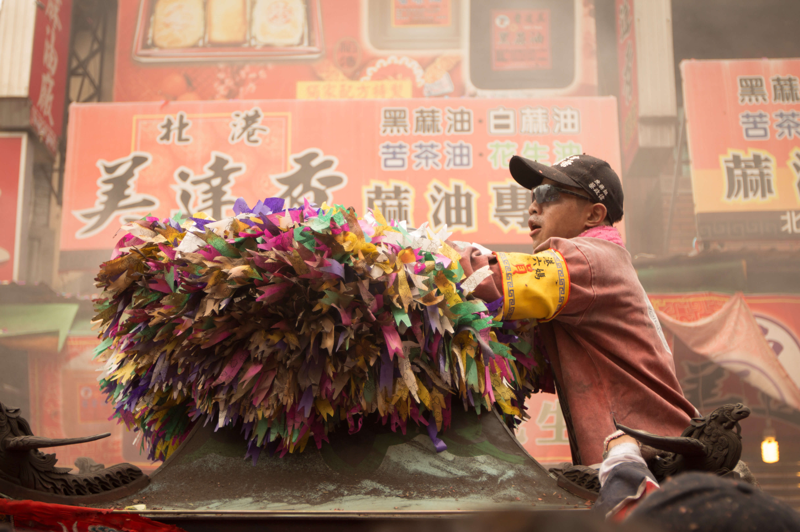
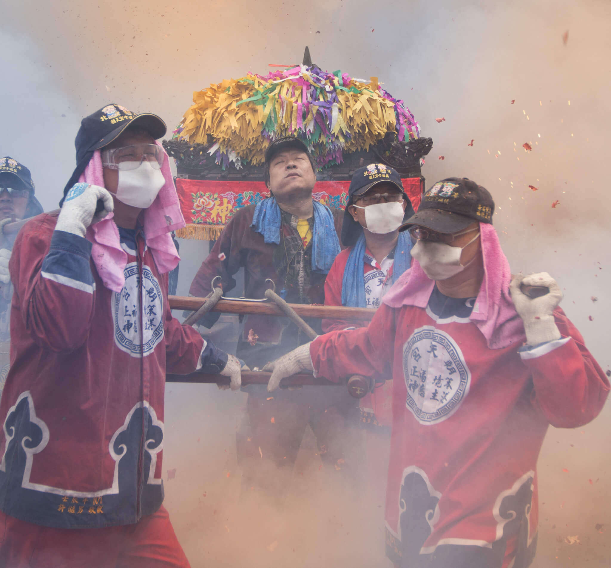

# 北港媽祖的轎錢、篙錢

大家都知道北港媽祖出巡時，轎頂要繫上篙錢(有人稱為轎錢)，但各位知道篙錢顏色是有區別的。

據老一代的傳統下來，純黃無花紋是用在虎爺及將軍(或是王爺轎)，有花紋者則用在媽祖、觀音菩薩及佛祖神轎，原因是尊敬媽祖等為出三界(欲界、色界、無色界)之聖人，而結彩幡表示崇敬、慈悲及其威德，並用於祈福，以別於純黃無花紋表示霸氣及鎮煞。目前只有北港的廟會神轎或者是北港朝天宮分靈的媽祖來進香或遶境時，轎頂才會繫上篙錢。但也有其他宮廟，見其好看，紛紛仿效，卻不知其用意。

篙錢的作用，主要用於祈福避邪。根據兒時的記憶，祖父輩及父執輩在遶境入廟，等到住持和尚誦經安座與迴向結束後，必須燃一枝立香向媽祖稟明參與遶境結束，將請篙錢回家安奉，並將篙錢過大爐火，連立香一起攜回，攜回的立香代表將媽祖香火帶回家中延續，篙錢則回家後沿著傳統竹製斗笠邊緣下綁牢(好像是綁八只，也有人綁四只)，並加裝一盞五燭光的燈泡，掛在戶外大門邊，用以趨邪，並表示媽祖的慈光庇佑夜歸或外出的親屬。

如果家中有人受到驚嚇，則在家中燃香呼請北港朝天宮「天上聖母菩薩摩訶薩」(摩訶薩是梵語，代表「大」；菩薩是梵語菩提薩埵的簡稱，代表覺有情，意即幫助眾生脫離苦海，到達清淨涅槃彼岸)，並稟明狀況及說明欲取篙錢收驚，擲筊得到聖杯，則取二、三張篙錢火化在陰陽水中，給當事人喝三口，未喝完者則潑到屋頂上或掩埋在乾淨土壤中，代表媽祖已幫忙收驚及化解完畢。此項傳統，在現今已多不復見，大多將篙錢請回後，放在家中鎮宅，也不知道可用來收驚(對小孩特別有效喔)。

千、順將軍的篙錢則是以黃色為主，民國七十年代，順風耳及千里眼將軍在入廟時，必須先行將頭上篙錢拿下，除因怕踩炮有引火的危險外，最主要是，進廟門那一剎那搶篙錢的人非常多，導致將軍有被解體或跌倒之虞(曾經發生過在拉扯時，將軍差點向後跌倒之情形)。近幾年，將軍不常見踩炮，搶篙錢的人也不復見了，所以入廟時依然繫著篙錢。

### 相關參考
* [北港新站 - 黑以桑提供](http://www.peikang.idv.tw)
* [吳政賢 攝影集](https://www.facebook.com/comdan66)
