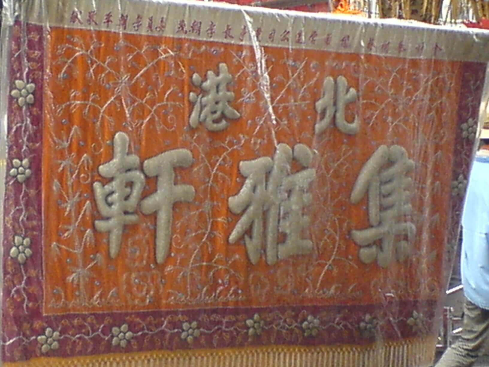
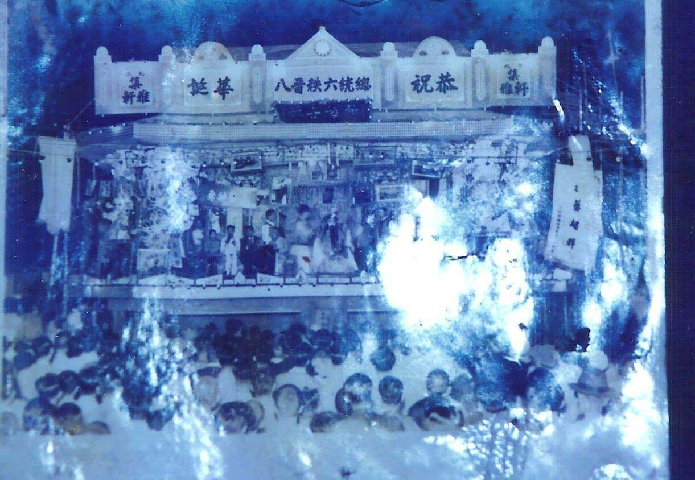

# 集雅軒

集雅軒創立於咸豐元年（1851），是笨港頗有名氣的北管子弟戲團。軒內存有一上百年純手工刺繡之大旗子及多本戲曲曲譜供民眾點選，文物保存良好。民國三十八年，購買傳統二落木造民宅於現址。這棟古樸的會館，本來面臨蕃簽市古街。但博愛路拓寬拆去其中一落，目前以第一落背面作為門面。入口開放三門，前段作為練習場所，後屏設龕供奉祖師爺西秦王爺－唐明皇。

會館供奉西秦王爺，左邊奉祀先輩神主牌位。早晚香氣芬芳、裊繞滿室。館內彩牌、托燈、鼓架、繡旗…精緻的作工，閃爍昔日的輝煌。集雅軒起初由地方人士**蔡及**、**陳真**、**吳石**…等十二人發起組成。老一輩曾提及集雅軒由**和樂軒**分出的淵源。

和樂軒是比集雅軒更早的北管子弟戲團（更早者尚有**仁和軒**）。和樂軒人才分散後，改聘京戲老師教授而轉成京戲劇團。集雅軒經由最初牌場、出陣，吸收的會員日漸增加，財源穩定後聘請老師教戲。日據時期打下演戲的基礎，民國十二年左右，更是興盛一時。其中戲服、彩牌、托燈、骨架等文物，皆精心製作之佳品。太平洋戰爭爆發，因經濟蕭條、皇民化運動等因素，民俗活動不如往常活絡。

台灣光復，集雅軒以深厚的民眾基礎再度招募新會員，民國四十年，可說達到全盛時期。包含站山（出錢的地方人士）、藝員（前後台演出者）共有一百六十人之多。媽祖轎班會、舖戶做平安戲、迎媽祖熱鬧陣等，都被邀請出陣或上棚，尤其是三月十九日，動用最多人力、物力及龐大陣容隨媽祖的神轎出巡。最興盛期，人手可分雙陣，一陣參加遶境，一陣演戲。學戲的人多到可以出雙棚戲，雙棚演員同時在加大的戲台上演戲，且戲碼有鳳鶴樓、忠義節等大戲。一棚演員就需二、三十人，其盛況可知。民國四十六年，曾被邀請到士林參加故總統蔣公六十八歲生日盛會，是集雅軒重要的歷史紀錄。

北港地處鄰近鄉村什榖集散中心，屬經濟不錯、宗教信仰熱誠的地區。由於地方人士熱烈參與及對子弟的鼓勵，兼且農業社會人口穩定，國民對戲曲的熱衷…種種因素，當時不僅集雅軒興盛，高甲仔（南管戲）歌仔戲、京戲、其他子弟團、文館、武館，如百花競相綻放，戲台間也有拼台的情形。

歌仔戲佔語言上的先天優勢，高甲、亂彈、京劇必須以武齣來取勝。子弟團多無會館，行頭則放在朝天宮內，一館一角落，集雅軒分配放置在觀音殿，入箱戲服則放在現今開山廳內，演練、套戲另覓處所，義民廟、李仔淵…等處都曾開過館。民國三十九年，集雅軒因站山會員捐獻和賞金，方有財源買下現今之會館。

日據時期，集雅軒曾聘過誰來教戲已無從查得，但其拿手好戲「倒銅旗」，則自日據傳承而來，當時扮演秦瓊的王金龍仍讓老弟子們津津樂道。秦瓊是老生武將，必須有武術底子配合，於是從髯義堂龍鳳獅請來師傅教授「雙金間」（武器名稱），王金龍學到出神入化，每演出必獲滿堂彩。光復後的老師，有集雅軒的老一輩蔡企，也是初創十二位先輩的後代；溪口埤仔頭請來做內台戲（職業戲團）的陳水德。德仙雖不識字，腦子裡卻能記下一、二十齣戲，忠義節、鳳鶴樓即是學自德仙；另有二崙油車高石貴，也擔任過集雅軒總綱。

集雅軒興盛得快，衰退得也快。在傳統社會結構趨向工商社會的轉型中，因媒體發達、大眾娛樂取向改變，加上家長不鼓勵、學生不願學，及政府對民俗曲藝不切實際的觀念等，集雅軒曾一度面臨散館命運。最後雖經多方奔走，將面臨解散或已解散的各個子弟戲團成員匯集起來，目前成員雖有百多人，樂團十多人卻大多年事已高，如收不到新血傳承，仍難逃散館的命運。農曆六月二十四日是西秦王爺誕辰，也是集雅軒會員聚集過爐的日子。

### 相關參考
* [從笨港到北港](http://www.cuy.ylc.edu.tw/~cuy14/eBook/ch3-4.htm)
* [舊北港遊客中心](https://www.facebook.com/PeikangVC)
* [吳政賢 攝影集](https://www.facebook.com/comdan66)
